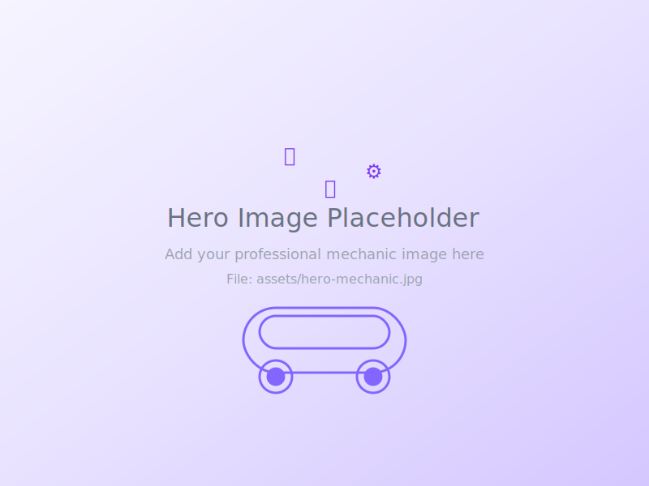

# 🎯 SIGUIENTE PASO: Agregar Imagen Hero

## ⚡ Estado Actual
✅ **Hero layout completo** (2 columnas grid)  
⏳ **Solo falta imagen real** (usando placeholder SVG)

## 🚀 Agregar Imagen (2 pasos)

### 1️⃣ Descargar imagen profesional
- **Búsqueda:** "female mechanic professional" en [Unsplash](https://unsplash.com)
- **Guardar como:** `assets/hero-mechanic.jpg` 
- **Tamaño:** 1200x800px min, formato JPG

### 2️⃣ Actualizar código 
En `index.html` línea 64, cambiar:
```html

```
por:
```html  

```

¡Y listo! 🎉

📋 **Instrucciones completas en:** [assets/SETUP.md](assets/SETUP.md)